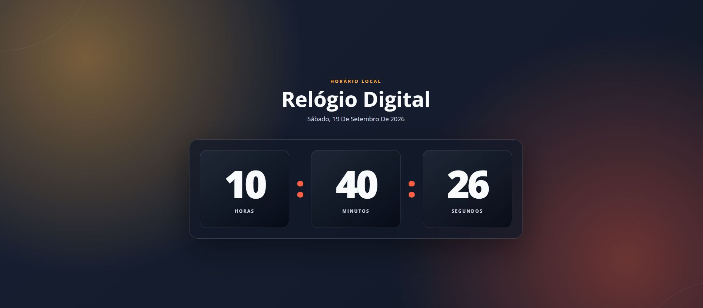

# Relógio Digital

Relógio digital responsivo que exibe a hora e a data local em tempo real. O projeto foi desenvolvido para praticar manipulação do DOM, datas em JavaScript, layout responsivo e acessibilidade.



## Demonstração

[Acesse o projeto publicado](https://gustavosaless1.github.io/relogio-digital/)

## Funcionalidades

- Exibição de horas, minutos e segundos.
- Atualização automática a cada segundo.
- Data completa formatada em português.
- Horário baseado no dispositivo do visitante.
- Layout adaptável para computadores e celulares.
- Estrutura semântica e descrição acessível do horário.

## Ferramentas do projeto

- HTML5
- CSS3
- JavaScript
- Google Fonts
- Git e GitHub

## Detalhes técnicos

- `Intl.DateTimeFormat` para formatar a data em português.
- `String.padStart()` para manter dois dígitos no relógio.
- `setInterval()` configurado para atualizar a interface a cada 1.000 milissegundos.
- `font-variant-numeric: tabular-nums` para evitar que os números desloquem o layout.
- Unidades responsivas com `clamp()` e CSS Grid.

## Como executar

Clone o repositório:

```bash
git clone https://github.com/GustavoSaless1/relogio-digital.git
```

Depois, abra o arquivo `index.html` no navegador ou utilize a extensão Live Server no VS Code.

## Estrutura do projeto

```text
relogio-digital/
├── css/
│   └── style.css
├── docs/
│   └── relogio-digital-preview.png
├── js/
│   └── script.js
├── index.html
└── README.md
```

## Próximas melhorias

- Permitir alternar entre os formatos de 12 e 24 horas.
- Adicionar seleção de fusos horários.
- Criar temas de cores alternativos.

## Autor

Desenvolvido por **Gustavo Sales**.

- [GitHub](https://github.com/GustavoSaless1)
- [LinkedIn](https://www.linkedin.com/in/gustavo-sales-a25662257/)
